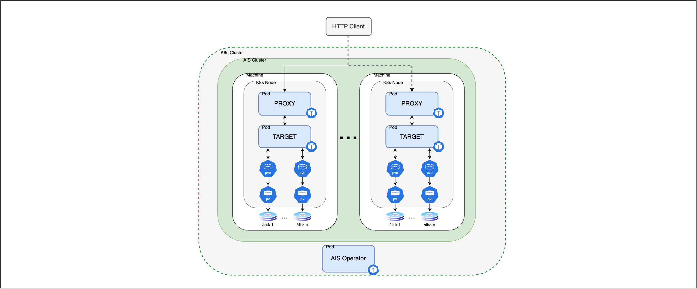

# AIStore on Kubernetes

[AIStore](https://github.com/NVIDIA/aistore) is a lightweight, scalable object storage solution designed for AI applications.
This repository serves as a complete toolkit for setting up AIStore in a Kubernetes (K8s) environment.

## Overview

- [**Documentation/Guide**](docs/README.md): This guide provides detailed, step-by-step instructions for deploying AIStore on K8s.
- [**Ansible Playbooks**](playbooks/README.md): These playbooks are designed to streamline the setup of Kubernetes worker nodes for hosting AIStore deployments.
- [**Kubernetes Operator**](operator/README.md): The AIS K8s Operator simplifies critical tasks such as bootstrapping, deployment, scaling, graceful shutdowns, and upgrades. It extends Kubernetes' native API, automating the lifecycle management of AIStore clusters.
- [**Helm Charts**](helm/README.md): Helm charts for deploying AIS resources to be controlled by the operator.
- [**Monitoring**](monitoring/README.md): Instructions and Helm charts for setting up a Kubernetes-based AIStore monitoring stack.

## A Simple System Overview

The diagram illustrates an AIStore deployment on a multi-node K8s cluster, with each node containing a `proxy` and a `target` pod.
The `proxy` redirects client requests to the `target` pods, which handle data storage and retrieval.
These pods utilize Persistent Volume Claims (PVCs) linked to Persistent Volumes (PVs) corresponding to actual storage disks.
The AIS Operator oversees the entire setup, managing all operations related to the cluster.

## Small Scale Experimental Deployments

This repository mainly focuses on production deployments of AIStore with multiple nodes and multiple drives per node. If you don't require such scale then consider checking out the [different deployment options available](https://github.com/NVIDIA/aistore?tab=readme-ov-file#deployment-options).

## Deployment Guide

For a clear and detailed roadmap, our [Step-by-Step Deployment Guide](docs/README.md) provides extensive instructions and best practices for setting up AIStore clusters on Kubernetes.

## AIStore Operator

The [AIS Operator](./operator/README.md) is responsible for managing the resources and lifecycle of AIS clusters in K8s. 
It is the only recommended and supported method for managing production-level AIS clusters in K8s.
