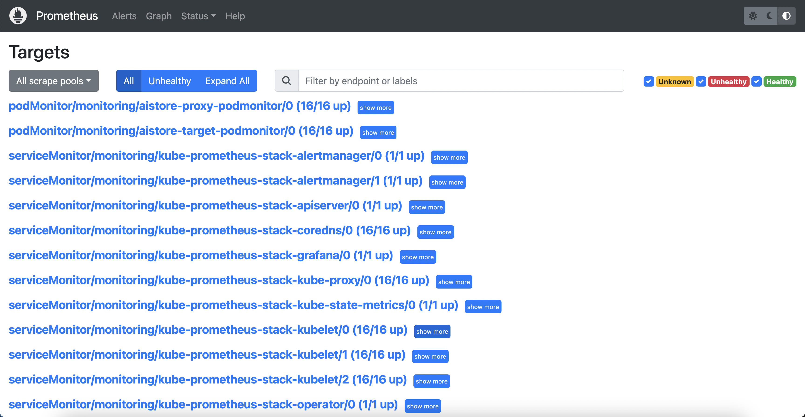

# Monitoring AIStore Cluster

Monitoring the performance and health of AIStore is essential for maintaining the efficiency and reliability of the system. This guide provides detailed instructions on how to monitor AIStore using both command-line tools and a Kubernetes-based monitoring stack.

## Monitoring - Using CLI

AIStore provides a [CLI (command-line interface)](https://github.com/NVIDIA/aistore/blob/main/docs/cli.md) with a [`show performance`](https://github.com/NVIDIA/aistore/blob/main/docs/cli/show.md#ais-show-performance) command. This command offers a snapshot of the cluster's performance, including throughput, latencies, disk IO, capacity, and more.

## Monitoring - Using kube-prometheus-stack
You can setup your own k8s stack for monitoring. For a comprehensive monitoring setup, we recommend the [kube-prometheus-stack](https://github.com/prometheus-community/helm-charts/tree/main/charts/kube-prometheus-stack) helm chart. This chart installs and integrates several components:

   - [Prometheus](https://prometheus.io/) and the [Prometheus Operator](https://github.com/prometheus-operator/prometheus-operator)
   - [AlertManager](https://prometheus.io/docs/alerting/latest/alertmanager/)
   - [Grafana](https://grafana.com/)
   - [kube-state-metrics](https://github.com/kubernetes/kube-state-metrics)
   - [node_exporter](https://github.com/prometheus/node_exporter)

This setup forms a foundational monitoring stack that can be extended as needed.


### Node Labeling for Monitoring
   Identify nodes designated for monitoring.
   
   ```bash
   kubectl get nodes
   ```
   > Note: In larger deployments, label only the nodes allocated for monitoring.

   Label these nodes accordingly:
   ```bash
   kubectl label node/node-01 'aistore.nvidia.com/role_monitoring=true'
   ...
   ```

### Creating a Monitoring Namespace
This namespace will house all monitoring-related nodes and services.
```bash
kubectl create ns monitoring
```

## Deploy kube-prometheus-stack
Ensure `helm` is installed. If not, follow the [installation guide](https://helm.sh/docs/intro/install/).

1. Install Helm using the provided script:
   ```bash
   curl -fsSL -o get_helm.sh https://raw.githubusercontent.com/helm/helm/main/scripts/get-helm-3
   chmod 700 get_helm.sh
   ./get_helm.sh
   ```

2. Add the prometheus-community repo to Helm:
   ```bash
   helm repo add prometheus-community https://prometheus-community.github.io/helm-charts
   helm repo update
   ```

3. Customize the chart values by editing [`kube_prometheus_stack_values.yaml`](../manifests/monitoring/kube_prometheus_stack_values.yaml). This involves setting `nodeAffinity`, `grafanaAdminPassword`, persistent stats storage (commented), and `securityContext`.

4. For setting the `securityContext`, specify details of a non-root user (typically UID > 1000). To identify existing non-root users, use the following command:
   ```bash
   awk -F: '$3 >= 1000 {print $1}' /etc/passwd
   ```
   Alternatively, you can either use an existing non-root user or create a new one. To obtain the UID and Group ID (GID) of a user, execute:
   ```bash
   id [username]
   ```
   Then, update the `kube_prometheus_stack_values.yaml` file with the user's UID and GID by setting the `runAsUser` and `runAsGroup` fields, respectively, under `securityContext`. Also, don't forget to set the `grafanaAdminPassword`.

> Important: If your monitoring nodes are labeled differently, remember to adjust the `key` value in the nodeAffinity configuration within the same file to match your custom label. The default setting is `aistore.nvidia.com/role_monitoring=true`.

### Chart Deployment
Deploy the Prometheus stack with customized values:
```bash
helm install -f https://raw.githubusercontent.com/NVIDIA/ais-k8s/main/manifests/monitoring/kube_prometheus_stack_values.yaml kube-prometheus-stack prometheus-community/kube-prometheus-stack --namespace monitoring
```

### Configuring Prometheus (Pod) Monitors
At this point, you'll have a prometheus instance running that mostly just monitors itself.

To monitor AIS, we'll need to add a couple of [PodMonitor](https://github.com/prometheus-operator/prometheus-operator/blob/main/Documentation/api.md#monitoring.coreos.com/v1.PodMonitor) definitions.

You can find two `PodMonitor` definitions in the file [`ais_podmonitors.yaml`](../manifests/monitoring/ais_podmonitors.yaml). Apply them:

```
kubectl -n monitoring apply -f https://raw.githubusercontent.com/NVIDIA/ais-k8s/main/manifests/monitoring/ais_podmonitors.yaml
```

When applied, the monitors will configure prometheus to scrape metrics from AIStore's proxy and target pods individually every 30 seconds.

### Accessing Prometheus UI
The UI is not directly accessible from outside the cluster. Options include changing the service type to `NodePort` or using port-forwarding:
```bash
kubectl edit svc kube-prometheus-stack-prometheus -n monitoring
# change `type: ClusterIP` to `type: NodePort`

# or use port-forwarding:
kubectl port-forward -n monitoring svc/kube-prometheus-stack-prometheus 9090
```
Access the UI via `http://localhost:<port>`. Find the NodePort/port assigned to the service:
```bash
kubectl get svc kube-prometheus-stack-prometheus -n monitoring
```
> Note: Depending on how you have configured you might need to `ssh -L <port>:localhost:<port> <user-name>@<ip-or-host-name>` into the machines port and view `localhost:<port>`.


 
## Setting Up Grafana Dashboard
`kube-prometheus-stack`'s grafana deployment makes use of the [kiwigrid k8s sidecar](https://github.com/kiwigrid/k8s-sidecar) image, which allows us to provide our own dashboards as Kubernetes [configMaps](https://kubernetes.io/docs/concepts/configuration/configmap/).

A sample dashboard can be found at [`aistore_dashboard.yaml`](../manifests/monitoring/aistore_dashboard.yaml). Apply it:

```bash

kubectl apply -n monitoring -f https://raw.githubusercontent.com/NVIDIA/ais-k8s/main/manifests/monitoring/aistore_dashboard.yaml
```

Similar to Prometheus, to access Grafana dashboard you will have to either change the service type to `NodePort` or using port-forwarding:
   ```bash
   kubectl edit svc kube-prometheus-stack-grafana -n monitoring
   # change `type: ClusterIP` to `NodePort` or use port-forwarding:
   # or, use port-forwarding
   kubectl port-forward -n monitoring svc/kube-prometheus-stack-grafana 3000:80
   ```
Access the UI via `http://localhost:<port>`. Find the NodePort/port assigned to the service:
```bash
kubectl get svc kube-prometheus-stack-grafana -n monitoring
```
> Note: Depending on how you have configured you might need to `ssh -L <port>:localhost:<port> <user-name>@<ip-or-host-name>` into the machines port and view `localhost:<port>`.

You'll need to use the username `admin` and the `grafanaAdminPassword` you chose earlier to log in.


Once logged in, you can import more dashboards to make the most of the `node-exporter` and `kube-state-metrics` deployments bundled with the chart if you wish. For detailed node and k8s related metrics we recommend this [dashboard](https://grafana.com/grafana/dashboards/1860-node-exporter-full/).